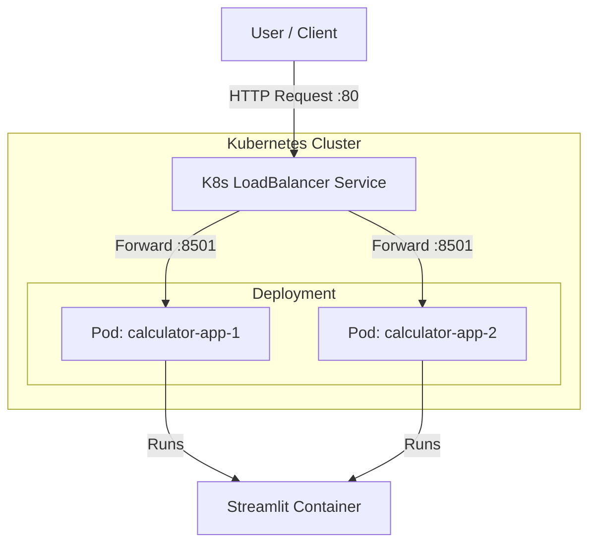

# Kubernetes Deployment Calculator App

A modern, containerized calculator application built with [Streamlit](https://streamlit.io/), designed to be deployed on Kubernetes. This project demonstrates a complete workflow from application development to containerization and orchestration.

## 🚀 Features

*   **Simple Interface:** Clean and responsive UI for basic and advanced mathematical operations.
*   **Operations:** 
    *   **Basic:** Addition, Subtraction, Multiplication, Division.
    *   **Scientific:** Power, Square Root, Logarithm (log10, ln), Trigonometry (Sin, Cos, Tan), Factorial.
*   **Containerized:** Fully Dockerized for consistent deployment environments.
*   **Scalable:** Configured for Kubernetes with multiple replicas and LoadBalancer service.

## 🏗️ Architecture

The application follows a microservices-compatible architecture deployed on Kubernetes.



## 📂 Project Structure

```text
.
├── calculator/                 # Application logic package
│   ├── __init__.py
│   └── calculator.py           # Calculator class implementation
├── app.py                      # Main Streamlit application entry point
├── Dockerfile                  # Docker image configuration
├── kube-deploy-service-app.yml # Kubernetes Deployment & Service manifest
├── requirements.txt            # Python dependencies
├── .dockerignore               # Files to exclude from Docker build
├── .gitignore                  # Git ignore rules
└── README.md                   # Project documentation
```

## 🛠️ Prerequisites

*   **Python 3.9+** (for local development)
*   **Docker** (for containerization)
*   **Kubernetes Cluster** (Minikube, Kind, or Cloud Provider like GKE/EKS/AKS)
*   **kubectl** CLI tool

## ⚡ Getting Started

### 1. Local Development

Clone the repository and install dependencies:

```bash
git clone https://github.com/Amirazizgithub/Kubernetes-Deployment-Calculator-App.git
cd Kubernetes-Deployment-Calculator-App

# Create a virtual environment (optional but recommended)
python -m venv .venv
source .venv/bin/activate  # On Windows: .venv\Scripts\activate

# Install dependencies
pip install -r requirements.txt

# Run the app
streamlit run app.py
```

Access the app at `http://localhost:8501`.

### 2. Docker Deployment

Build and run the container locally:

```bash
# Build the image
docker build -t calculator-app:v1 .

# Run the container
docker run -p 8501:8501 calculator-app:v1
```

Access the app at `http://localhost:8501`.

### 3. Kubernetes Deployment

Deploy the application to your Kubernetes cluster:

```bash
# Apply the combined Deployment and Service manifest
kubectl apply -f kube-deploy-service-app.yml

# Check the status of pods
kubectl get pods

# Get the service external IP (if using LoadBalancer)
kubectl get svc calculator-app
```

If you are using **Minikube**, you might need to run the following command to access the LoadBalancer service:

```bash
minikube tunnel
```

## 📜 License

This project is licensed under the MIT License - see the [LICENSE](LICENSE) file for details.