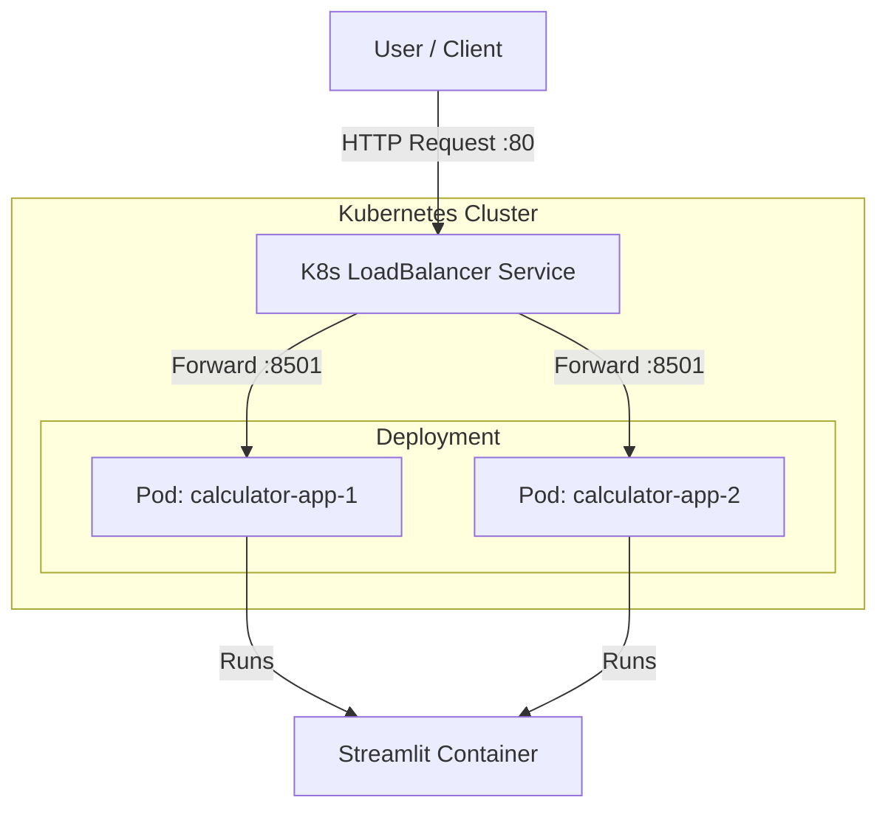

# Kubernetes Deployment Calculator App

A modern, containerized calculator application built with [Streamlit](https://streamlit.io/), designed to be deployed on Kubernetes. This project demonstrates a complete workflow from application development to containerization and orchestration.

## 🚀 Features

*   **Simple Interface:** Clean and responsive UI for basic and advanced mathematical operations.
*   **Operations:** 
    *   **Basic:** Addition, Subtraction, Multiplication, Division.
    *   **Scientific:** Power, Square Root, Logarithm (log10, ln), Trigonometry (Sin, Cos, Tan), Factorial.
*   **Containerized:** Fully Dockerized for consistent deployment environments.
*   **Scalable:** Configured for Kubernetes with multiple replicas and LoadBalancer service.

## 🏗️ Architecture

The application follows a microservices-compatible architecture deployed on Kubernetes.



## 📂 Project Structure

```text
Kubernetes-Deployment-Calculator-App
├── calculator/                 # Application logic package
│   ├── __init__.py
│   └── calculator.py           # Calculator class implementation
├── app.py                      # Main Streamlit application entry point
├── Dockerfile                  # Docker image configuration
├── kube-deploy-service-app.yml # Kubernetes Deployment & Service manifest
├── requirements.txt            # Python dependencies
├── .dockerignore               # Files to exclude from Docker build
├── .gitignore                  # Git ignore rules
└── README.md                   # Project documentation
```

## 🛠️ Prerequisites

*   **Python 3.9+** (for local development)
*   **Docker** (for containerization)
*   **Kubernetes Cluster** (Minikube, Kind, or Cloud Provider like GKE/EKS/AKS)
*   **kubectl** CLI tool

## ⚡ Getting Started

### 1. Local Development

Clone the repository and install dependencies:

```bash
git clone https://github.com/Amirazizgithub/Kubernetes-Deployment-Calculator-App.git
cd Kubernetes-Deployment-Calculator-App

# Create a virtual environment (optional but recommended)
python -m venv .venv
source .venv/bin/activate  # On Windows: .venv\Scripts\activate

# Install dependencies
pip install -r requirements.txt

# Run the app
streamlit run app.py
```

Access the app at `http://<External-IP>:8501`.

### 2. Docker Deployment

Build and run the container locally:

```bash
# Build the image
docker build -t calculator-app:latest .

# Run the container
docker run -p 8501:8501 calculator-app:latest
```

Access the app at `http://<External-IP>:8501`.

### 3. Kubernetes Deployment

Deploy the application to your Kubernetes cluster:

```bash
# Apply the combined Deployment and Service manifest
kubectl apply -f kube-deploy-service-app.yml

# Check the status of pods
kubectl get pods

# Get the service external IP (if using LoadBalancer)
kubectl get svc calculator-app
```

If you are using **Minikube**, you might need to run the following command to access the LoadBalancer service:

```bash
minikube tunnel
```

### 4. GKE Deployment & CI/CD Pipeline

This project includes a fully automated CI/CD pipeline using **GitHub Actions** to deploy the application to **Google Kubernetes Engine (GKE)**.

#### Prerequisites on Google Cloud Platform (GCP)

1.  **Google Cloud Project**: Create a new project or use an existing one.
2.  **Artifact Registry**: Create a Docker repository in Artifact Registry to store your container images.
3.  **GKE Cluster**: Create a Kubernetes cluster (Standard or Autopilot).
4.  **Service Account**: Create a Service Account with the following roles:
    *   `Artifact Registry Writer`
    *   `Kubernetes Engine Developer`
    *   `Service Account User`
5.  **JSON Key**: Generate and download a JSON key for this Service Account.

#### GitHub Secrets Configuration

To enable the pipeline, go to your GitHub Repository **Settings > Secrets and variables > Actions** and add the following repository secrets:

| Secret Name | Description | Example Value |
| :--- | :--- | :--- |
| `GCP_PROJECT_ID` | Your Google Cloud Project ID | `my-gcp-project-id` |
| `GCP_REGION` | Region for your resources | `us-central1` |
| `GCP_IMAGE_URI` | Full Artifact Registry image path | `us-central1-docker.pkg.dev/project-id/repo/image` |
| `GCP_CLUSTER_NAME` | Name of your GKE Cluster | `my-cluster` |
| `GCP_SA_KEY` | Content of the Service Account JSON key | `{"type": "service_account", ...}` |

#### CI/CD Workflow Overview

The pipeline is defined in `.github/workflows/cicd-action-pipeline.yaml` and consists of two main jobs:

1.  **Continuous Integration (CI)**:
    *   Checks code formatting with `Black`.
    *   Builds the Docker image.
    *   Pushes the image to Google Artifact Registry.

2.  **Continuous Deployment (CD)**:
    *   Authenticates with GKE using the `gke-gcloud-auth-plugin`.
    *   Updates the Kubernetes Deployment with the new image version.
    *   Applies the configuration using `kubectl`.

The pipeline triggers automatically on every push to the `main` branch.

## 📜 License

This project is licensed under the MIT License - see the [LICENSE](LICENSE) file for details.